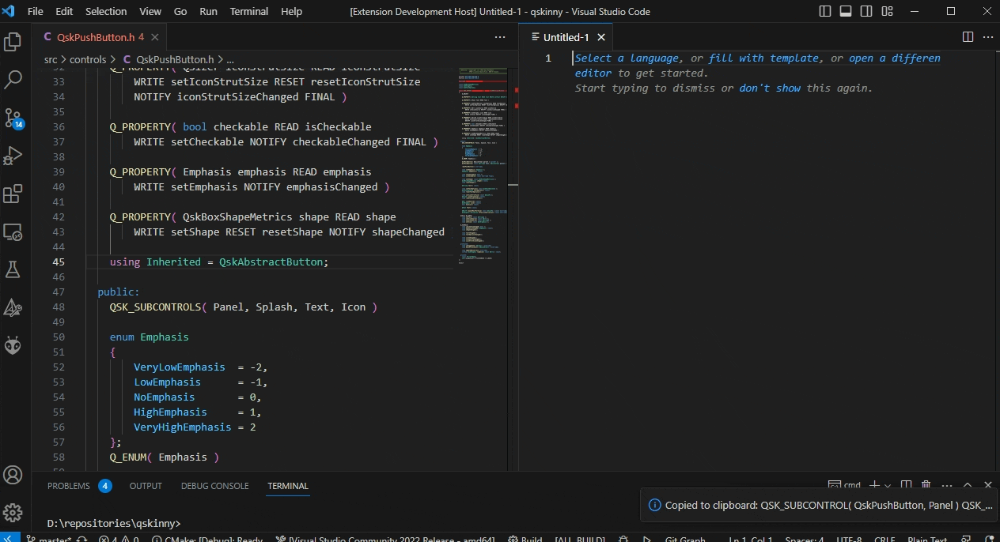
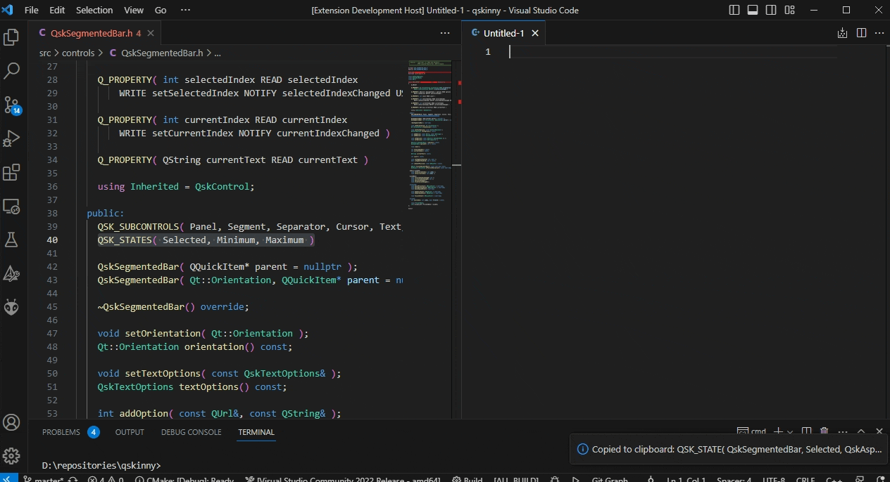
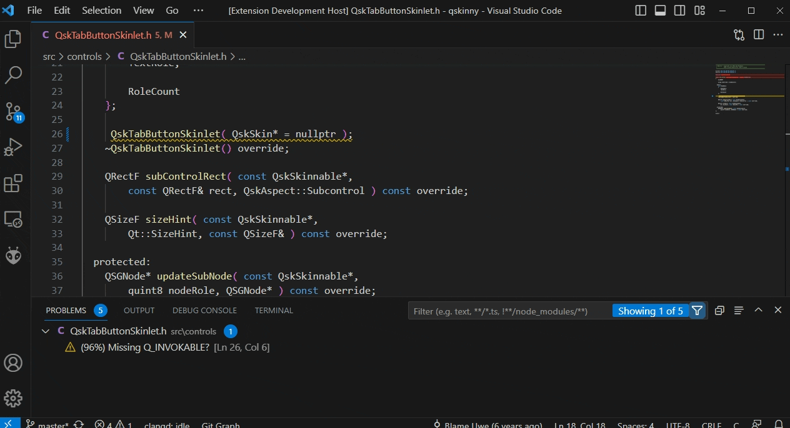
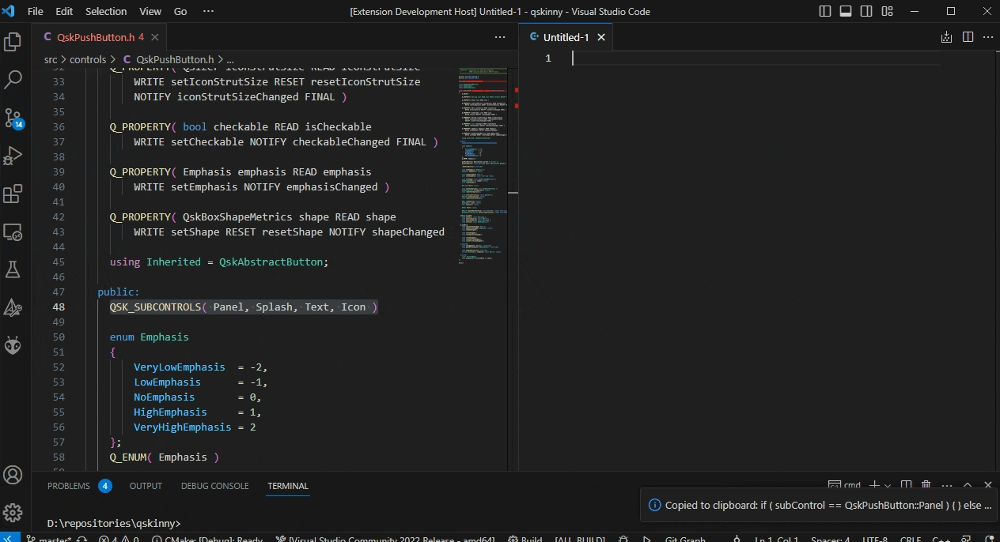
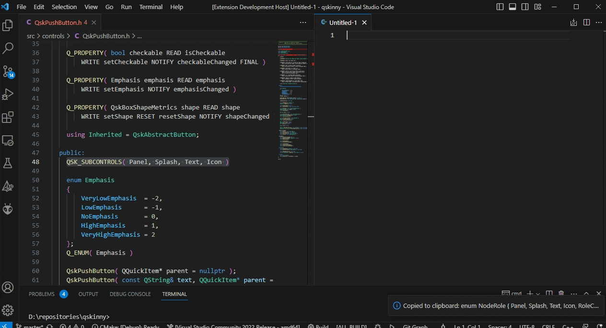
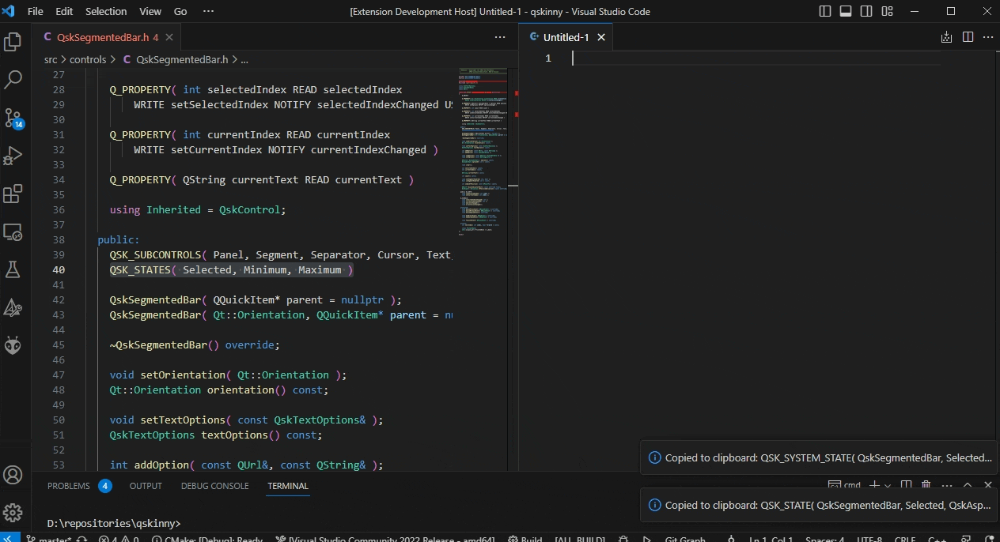
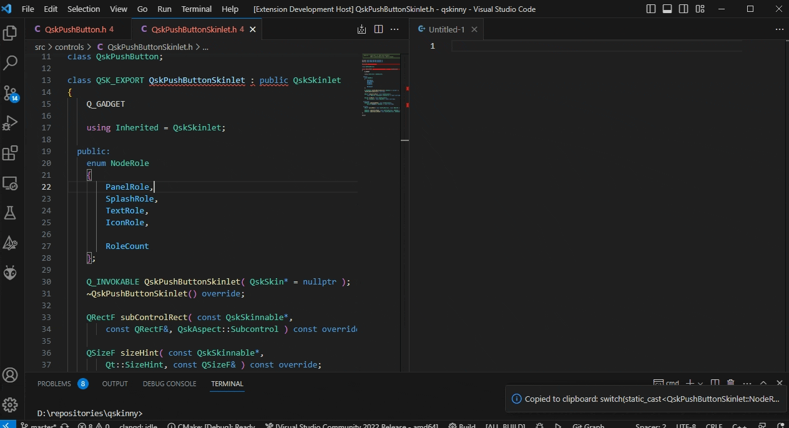
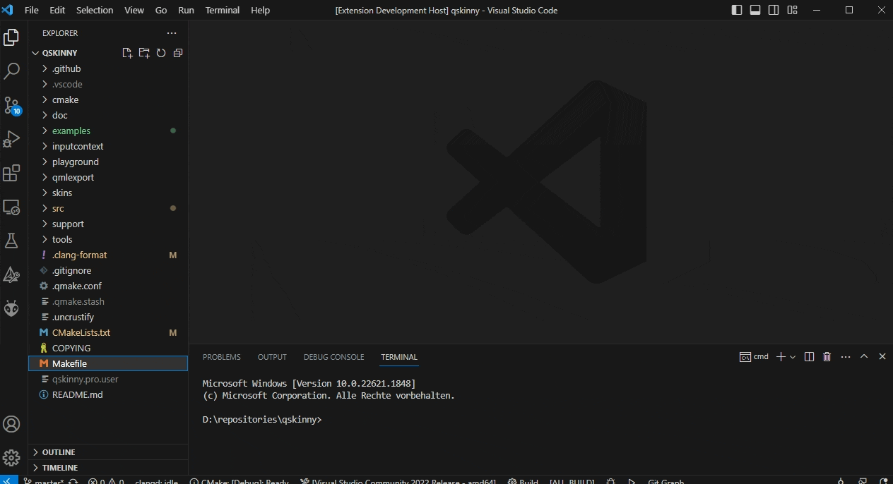

# QSkinny VS Code Extension

> The (Q)Skinny library is a framework built on top of the Qt scene graph and very few core classes from Qt/Quick. It offers a set of lightweight controls, that can be used from C++ and/or QML.
> 
> -- <cite>[QSkinny Repository](https://github.com/uwerat/qskinny)</cite>

This extension provides usefull commands to accelerate QSkinny / C++ code generation.

## Features

- Transforming `QSK_SUBCONTROLS` or `QSK_STATES` declarations into initializations

|QSK_SUBCONTROLS|QSK_STATES|
|-|-|
|||

- Transforming `QSK_SUBCONTROLS` declarations into sequences of if/switch statements
- Simple static code analysis for e.g. missing `Q_INVOKABLE` macro in skinlet declarations



## Commands

### QSK: QSK_SUBCONTROLS(...) - Input

An example input / text selection assumed as input for the following commands' output

```cpp
QSK_SUBCONTROLS( Overlay, Panel, Segment, Cursor, Text, Icon, Separator )
```

### QSK: QSK_SUBCONTROLS(...) => QSK_SUBCONTROL(..., ...) - Output

Transforms a QSK_SUBCONTROLS(...) declaration into a sequence of QSK_SUBCONTROL(..., ...) initializations (one per subcontrol)

```cpp
QSK_SUBCONTROL( QskMenu, Overlay )
QSK_SUBCONTROL( QskMenu, Panel )
QSK_SUBCONTROL( QskMenu, Segment )
QSK_SUBCONTROL( QskMenu, Cursor )
QSK_SUBCONTROL( QskMenu, Text )
QSK_SUBCONTROL( QskMenu, Icon )
QSK_SUBCONTROL( QskMenu, Separator )
```


### QSK: QSK_SUBCONTROLS(...) => if( subControl == ...) - Output

Transforms a QSK_SUBCONTROLS(...) declaration into a sequence of empty (else)if statements (one per subcontrol)

```cpp
if ( subControl == QskMenu::Overlay ){}
else if ( subControl == QskMenu::Panel ){}
else if ( subControl == QskMenu::Segment ){}
else if ( subControl == QskMenu::Cursor ){}
else if ( subControl == QskMenu::Text ){}
else if ( subControl == QskMenu::Icon ){}
else if ( subControl == QskMenu::Separator ){}
```



### QSK: QSK_SUBCONTROLS(...) => enum NodeRole { ... }

Transforms a QSK_SUBCONTROLS(...) declaration into a node roles enum declaration (one enumerator per subcontrol)

```cpp
enum NodeRole
{
	Overlay,
	Panel,
	Segment,
	Cursor,
	Text,
	Icon,
	Separator,
};
```



### QSK: QSK_STATES(...) - Input

```cpp
QSK_STATES( Checked, Pressed )
```

### QSK: QSK_STATES(...) => QSK_STATE(..., ..., ...) - Output

Transforms a QSK_STATES(...) declaration into a sequence of QSK_STATE(..., ..., QskAspect::FirstUserState << ...) initializations (one per subcontrol)

```cpp
QSK_STATE( QskAbstractButton, Checked, QskAspect::FirstUserState << 0 )
QSK_STATE( QskAbstractButton, Pressed, QskAspect::FirstUserState << 1 )
```


### QSK: QSK_STATES(...) => QSK_SYSTEM_STATE(..., ..., ...) - Output

Transforms a QSK_STATES(...) declaration into a sequence of QSK_STATE(..., ..., QskAspect::FirstSystemState << ...) initializations (one per subcontrol)

```cpp
QSK_SYSTEM_STATE( QskAbstractButton, Checked, QskAspect::FirstSystemState << 0 )
QSK_SYSTEM_STATE( QskAbstractButton, Pressed, QskAspect::FirstSystemState << 0 )
```



### QSK: enum NodeRole - Input

```cpp
enum NodeRole
{
    PanelRole,
    SplashRole,
    TextRole,
    IconRole,
    RoleCount
};
```

### QSK: enum NodeRole => switch(...) - Output

Transforms an enumeration declaration into a switch statement (one case per subcontrol)

```cpp
switch(static_cast<Q::NodeRole>(role))
{
	case Q::NodeRole::PanelRole:
		break;
	case Q::NodeRole::SplashRole:
		break;
	case Q::NodeRole::TextRole:
		break;
	case Q::NodeRole::IconRole:
		break;
	case Q::NodeRole::RoleCount:
		break;
	default:
		break;
}
```



### QSK: enum NodeRole => template<NodeRole> - Output

> This is considered an `advanced command`

```cpp
// TODO move to .h file
template<NodeRole>
Q_REQUIRED_RESULT QSGNode* updateSubNode( const QskSkinnable* skinnable, QSGNode* node) const;

// TODO move to .cpp file
template<NodeRole>
QSGNode* QskPushButtonSkinlet::updateSubNode( const QskSkinnable* skinnable, QSGNode* node) const = delete;

template<>
QSGNode* QskPushButtonSkinlet::updateSubNode<QskPushButtonSkinlet::NodeRole::PanelRole>( const QskSkinnable* skinnable, QSGNode* node) const{}

template<>
QSGNode* QskPushButtonSkinlet::updateSubNode<QskPushButtonSkinlet::NodeRole::SplashRole>( const QskSkinnable* skinnable, QSGNode* node) const{}

template<>
QSGNode* QskPushButtonSkinlet::updateSubNode<QskPushButtonSkinlet::NodeRole::TextRole>( const QskSkinnable* skinnable, QSGNode* node) const{}

template<>
QSGNode* QskPushButtonSkinlet::updateSubNode<QskPushButtonSkinlet::NodeRole::IconRole>( const QskSkinnable* skinnable, QSGNode* node) const{}

template<>
QSGNode* QskPushButtonSkinlet::updateSubNode<QskPushButtonSkinlet::NodeRole::RoleCount>( const QskSkinnable* skinnable, QSGNode* node) const{}

```

### QSK: enum NodeRole => switch(...) template<NodeRole> - Output

> This is considered an `advanced command`

```cpp
QSGNode* QskPushButtonSkinlet::updateSubNode( const QskSkinnable* const skinnable, const quint8 role, QSGNode* const node ) const override;
{
	using R = QskPushButtonSkinlet::NodeRole;
	switch( static_cast< QskPushButtonSkinlet::NodeRole >( role ) )
	{
		case R::PanelRole: return updateSubNode<R::PanelRole>(skinnable, node);
		case R::SplashRole: return updateSubNode<R::SplashRole>(skinnable, node);
		case R::TextRole: return updateSubNode<R::TextRole>(skinnable, node);
		case R::IconRole: return updateSubNode<R::IconRole>(skinnable, node);
		case R::RoleCount: return updateSubNode<R::RoleCount>(skinnable, node);
		default: return Inherited::updateSubNode(skinnable, role, node);
	}
}
```

### QSK: Skinnable + Skinlet

Semi-interactive command that creates a skinnable and skinlet template



## Requirements

Currently none

## Extension Settings

This extension contributes the following settings:

* `qskinny.advancedCommands`: Enable/disable advanced commands.

## Known Issues

Currently none

## Release Notes

Currently none

### 0.0.1

Initial release